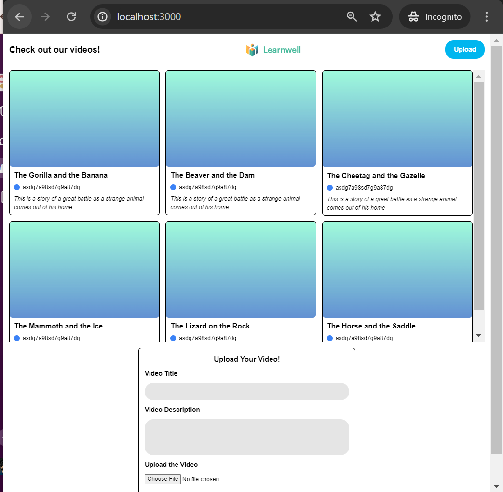
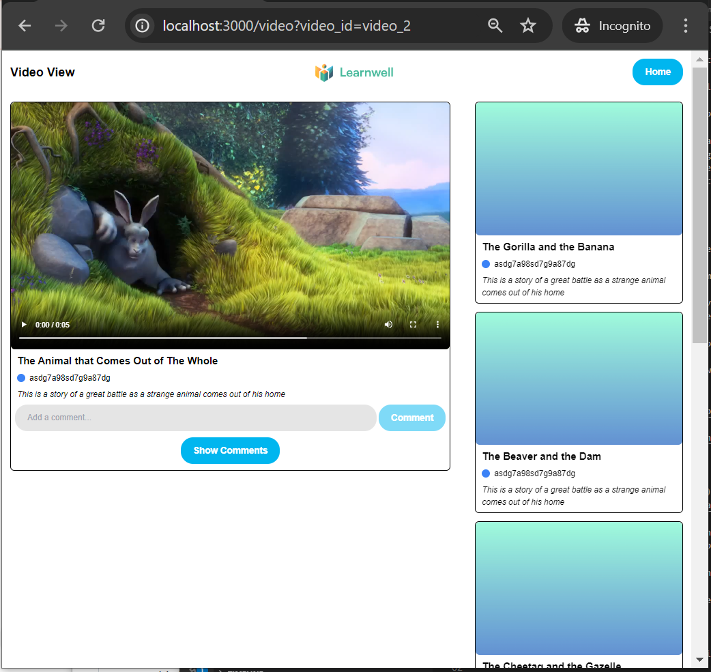

## Overview

This my submission for the Scope Labs Coding Assessment, which tasks the user with creating an educational website for viewing videos. Specifically, I was tasked with making a website with the following capabilities:

- Show a list of videos and allow users to select a video from the list
- Allow the user to create a new video object with:
  - title
  - description
  - video URL
- Provide functionality for viewing and adding comments to videos
  - Allow user to comment on a video
  - Let users view comments from other users
- Open the videos in full screen with full playback functionality.
  - I assumed "fully playback functionality does not include the following:
    - Closed Captions
    - Quality Selection: Change the resolution or quality of the video stream.
- Include options for adjusting playback speed and volume.

Additionally, this website needed to be designed to interact with a basic server provided by the Scope Labs team. Scope Labs provided the spec for their API (https://take-home-assessment-423502.uc.r.appspot.com/docs#/videos/)

We were also allowed to use branding files and optionally request a figma file as inspiration for the website. I used both of these resources significantly in my implementation.

In general, Scope Labs instructed us to make reasonable assumptions and design decisions based on the project requirements provided, with the understanding that this challenge would help exemplify our ability to work in an environment with only some of the necessary informatio provided.

## Project Structure

This web application includes 2 pages:

- Home Page

  - Clicking on any of the videos in the gallery brings you to tne 'Single Video Page' for that video
  - Clicking on the Upload button in the top right corner shows an Upload Video Form at the bottom of the screen
    - The Upload Video Form allows you upload a new video with the video file, title, and description
      of your choice.
    - Clicking the Submit button on the Upload Video form will attempt to send the video to the server with the details provided
      - The form will show a success message if sending a video to the server succeeds
      - The form will show an error message if sending a video to the server failed
    - The form also prevents users from sending a video to the server until all fields are filled out, showing error messages indicating which form element is preventing the user from proceeding

- Single Video Page

  - Shows a main video on the left, and a vertical video list on the right
    - Clicking on any of the videos in the video list brings you to 'Single Video Page'
      for that video
  - Allows users to view comments on the main video by clicking on the Show Comments button
    - If comments could not be retrieved, it shows an error message
  - Allows users to add comments for the video
    - Shows error or success messages depending on whether the comment could be successfully sent to the server
  - Clicking on the Home button in the top right corner brings you back to the Home Page

  Here are some pictures of the website, with dummy data used for the video list and video gallery being shown

**Home Page**

**Single Video Page**


## Project Tech Stack

- This is a [Next.js](https://nextjs.org/) and React web application, bootstrapped with [`create-next-app`](https://github.com/vercel/next.js/tree/canary/packages/create-next-app)
  - NOTE: While Next.js allows developers to additionally make backend endpoints, I did not create any API endpoints for the purposes of this Coding Challenge, although I did model some of the data to be retrieved from the server using types in TypeScript. The `hello.ts` api endpoint came with the app when I created the app using `create-next-app`.
- This project uses TailwindCSS for styling throughout the app
- This project uses TypeScript to provide typing throughout the React components, particularly for component props and dummy data retrieved from the server

## Getting Started

To run the app locally, follow the following steps:

1. Clone the repo to your local machine

2. Navigate to the project folder and run `npm install` to install the project dependencies

3. Once dependencies have been installed, run `npm run dev` to run the app

4. Once the app finishes compiling, ppen [http://localhost:3000](http://localhost:3000) with your browser to see the result

## Testing the Project

### Testing WITHOUT an API

The most straightforward to test the application WITHOUT a connection to the basic API server is to use the dummy data provided in the `sampleData.ts` file

#### Placeholder Videos for the Video Gallery and Video List

To see what the app looks like with various videos that don't have video thumbnails, delete all the code in the `fetchVideosFromServer()` function, and replace it with the following code. **Note the import statement needed at the top of the file**

```
  import { SAMPLE_VIDEO_LIST } from '@/sampleData/sampleData';


  const fetchVideosFromServer = async () => {
    setAllVideos(SAMPLE_VIDEO_LIST);
  };
```

This will allow you to scroll through videos on the Home page and Single Video Page. It will also allow you to click on a video on either page to bring you to the Single Video Page for that specific video.

#### Play an Example Video

To check that the app allows users to play videos with speed, volume, and full screen functionality, we need to update code in the Single Video Page, found in the file `src/pages/video.tsx`. Look for the code near the comment `{/* Main Video */}`, it should look like this:

```
        {/* Main Video */}
        <div className='col-span-2 p-4'>
          {/* If we have videoData, show the video
              Otherwise, show a video card telling the user to try another video */}
          {videoData ? (
            <VideoCard
              videoDataURI={videoData?.video_url}
              videoMetaData={{ ...videoData, video_thumbnail: '' }}
              showVideoComments
            />
```

Update this code with these changes:

1. Replace `videoData ?` with `true ?`
2. Replace `videoDataURI={videoData?.video_url}` with `videoDataURI={SAMPLE_VIDEO_PATH}`
3. Replace `..videoData` with `...SAMPLE_VIDEO_META_DATA`
4. Add the folowing import to the top of the file

```
   `import {
  SAMPLE_VIDEO_META_DATA,
  SAMPLE_VIDEO_PATH,
} from '@/sampleData/sampleData';`
```

Your final code should look like this.

```
        {/* Main Video */}
        <div className='col-span-2 p-4'>
          {/* If we have videoData, show the video
              Otherwise, show a video card telling the user to try another video */}
          {true ? (
            <VideoCard
              videoDataURI={SAMPLE_VIDEO_PATH}
              videoMetaData={{ ...SAMPLE_VIDEO_META_DATA, video_thumbnail: '' }}
              showVideoComments
            />
```

And voila! If you navigate to `localhost:3000/video`, you should be able to play a video that lasts a few seconds, and test out full screen, speed, and volume controls on it

#### View Example Comments

Assuming you have finished the "Play an Example Video" section, you should be able to view comments for a video by updating the `VideoCommentsSection` component.

Head to the `src/components/VideoCommentsSection.tsx` file and find the `fetchCommentsFromServer()` function.
Remove the big try/catch statement in that file and replace it with a call to `setComments()`. Your function should now look like this:

(**Note the import for `EXAMPLE_COMMENTS` you need to add to the top of the file**)

```
import { EXAMPLE_COMMENTS } from '@/sampleData/sampleData';

 const fetchCommentsFromServer = async () => {
    // Reset the error message before we fetch the comments
    setErrorMessage('');

    // Start showing a loading indicator while we fetch the comments
    setIsLoadingComments(true);

    setComments(EXAMPLE_COMMENTS);

    // Stop showing the loading indicator, since we finished fetching the comments
    setIsLoadingComments(false);
  };
```

#### Creating Videos and Adding Comments

Unlike the viewing of comments or videos, it is more difficult to replicate the behavior of successfully adding a video or comment to the website without communicating with an API server. For testing these functionalities, I would recommend the following:

- Creating a Video
  - Go to the Home page
  - Click on the Upload button at the top of the page to bring up the Create Video Form
  - Fill out the Title and Description fields
  - Upload a video of your choice (you can use the video found at `public/SampleVideo_1280x720_1mb.mp4` if you have no videos of your own)
  - Click the submit button. This will show an error message because we are interacting with the website without a corrresponding server
  - If you'd like to test out adding a video successfully create a file at `src/pages/api/videos.ts`, and implement the `POST /videos` endpoint by defining the `handler()` function in that file
    - For the specification for the `POST /videos` endpoint, see the Scope Labs Take Home Test API spec: https://take-home-assessment-423502.uc.r.appspot.com/docs#/
    - For information on how to implement a simple endpoint using the `handler()` function, see this link https://nextjs.org/learn-pages-router/basics/api-routes/creating-api-routes
- Adding a Comment
  - Finish the **View Example Comments** step defined above so you actually see the add comment button
  - Go to the Single Video Page
  - Locate the Main Video (the large video) on the left side of the screen
  - Below the Main Video, locate the the textbox with the "Comment" button to the right of it. This is the Add Comment component
  - Type into the textbox so that the Comment button is no longer a faded blue color
  - Click the submit button. This will show an error message because we are interacting with the website without a corrresponding server
  - If you'd like to test out adding a comment successfully, you will have to do the following:
    - Create a new folder at `src/pages/api/videos/`
    - In that new folder, create a new file at `src/pages/api/videos/comments.ts`, and implement the `POST /videos/comments` endpoint by defining the `handler()` function in that file
  - For the specification for the `POST /videos/comments` endpoint, see the Scope Labs Take Home Test API spec: https://take-home-assessment-423502.uc.r.appspot.com/docs#/videos/
  - For information on how to implement a simple endpoint using the `handler()` function, see this link: https://nextjs.org/learn-pages-router/basics/api-routes/creating-api-routes

### Testing WITH an API

The above section is provided for normal readers of this README who do not have access to an implementation of the Scope Labs Take Home Test API. However, for the Scope Labs team, it is assumed that the website should work as expected as long as the server adheres to the assumptions provided in the **Design Decisions** section. Here are two possibilities"

- If the Scope Labs team has implemented their API in Next.js, they can copy over the relevant API code to this project on their local machine, setup a database and larger storage framework to store video data, video meta data, and comments data, and test the website as normal
- Alternatively, if the Scope Labs team does not want to copy over their existing server environment to their local machine, they can update all calls to `axios.get()` and `axios.post()` in the code with the root url of their existing public server. For example:
  **Before:**

```
 await axios.get(`/videos/single?video_id=${video_id}`)
```

**After:**

```
 await axios.get(`https://scope.labs.public.server.com/videos/single?video_id=${video_id}`);
```

This should allow the team to test the website as expected

Happy testing!
